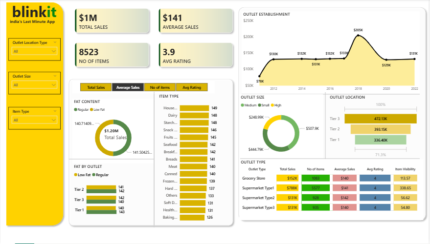

# Blinkit Sales Dashboard

An interactive Power BI report exploring grocery sales across products and outlet characteristics.

## Dashboard

Open [`Blinkit_Sales_Dashboard.pbix`](Blinkit_Sales_Dashboard.pbix) in Power BI Desktop.

## Dataset

The accompanying workbook contains 8,523 data rows and 12 fields: `Item Fat Content`, `Item Identifier`, `Item Type`, `Outlet Establishment Year`, `Outlet Identifier`, `Outlet Location Type`, `Outlet Size`, `Outlet Type`, `Item Visibility`, `Item Weight`, `Sales`, and `Rating`.

Source file: [`BlinkIT_Grocery_Data.xlsx`](BlinkIT_Grocery_Data.xlsx).

## Files

- `Blinkit_Sales_Dashboard.pbix` — Power BI report
- `BlinkIT_Grocery_Data.xlsx` — source workbook used with the report

## Requirements

- Power BI Desktop
- The included Excel workbook if Power BI prompts to relink its source

## Dashboard preview

